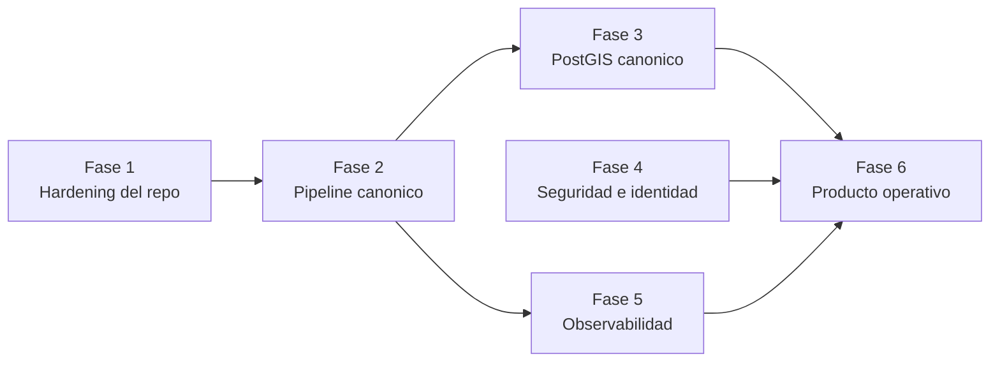
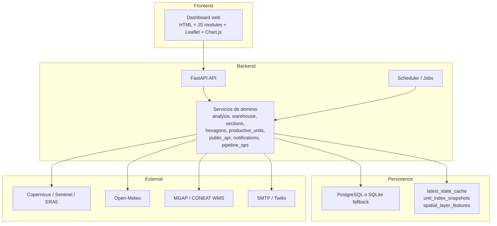
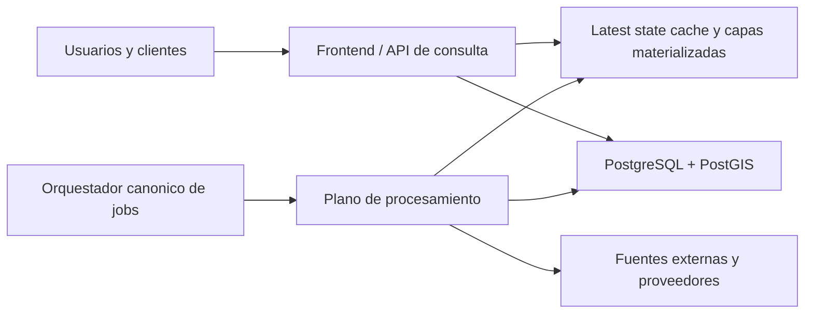
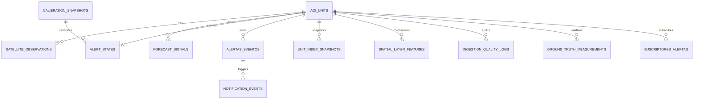
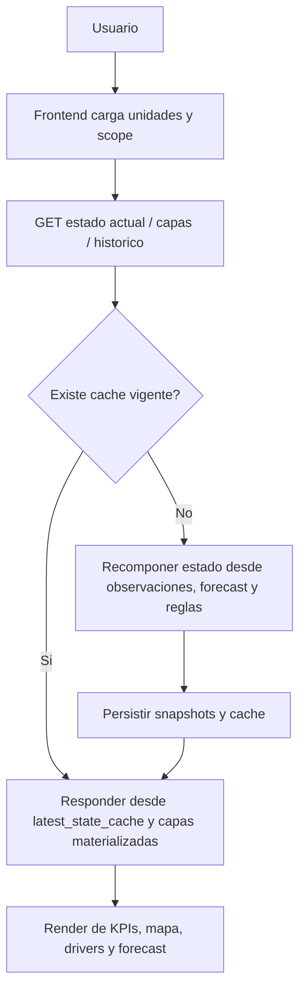
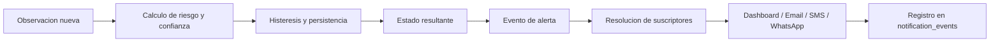

# AgroClimaX
## Documento Maestro Conceptual, Funcional, Arquitectonico y de Evolucion

**Version:** 1.0  
**Fecha:** 2026-03-26  
**Estado:** Documento maestro consolidado  
**Audiencia:** Direccion, producto, arquitectura, ingenieria y operacion  
**Marco de referencia:** Documento estructurado con criterio tecnico profesional, alineado con buenas practicas tipo ISO/IEC 42010

---

## 1. Resumen Ejecutivo

AgroClimaX es una plataforma de monitoreo, evaluacion y alerta agroclimatica orientada a transformar datos geoespaciales, satelitales, meteorologicos y operativos en decisiones accionables. El sistema busca detectar deterioro hidrico, contextualizarlo espacialmente, medir su severidad, expresar su nivel de confianza y comunicarlo a escala nacional, departamental y productiva.

La propuesta de valor del sistema no consiste solo en "mostrar mapas", sino en operar como una plataforma de inteligencia territorial que:

- integra observacion remota y contexto agroambiental
- modela riesgo y confianza por unidad espacial
- mantiene trazabilidad tecnica sobre cada alerta
- soporta decision operacional, monitoreo continuo y escalamiento
- se prepara para evolucionar desde monitoreo hacia sistema operativo de alerta temprana

AgroClimaX ya cuenta con una base tecnologica funcional y con varias capacidades maduras para su etapa actual:

- backend modular con FastAPI
- frontend web modular con capacidades geoespaciales
- pipeline diario y recalibracion
- cache materializada y capas derivadas para consulta rapida
- soporte para departamentos, secciones, H3 y unidades productivas
- notificaciones, suscriptores y base para validacion de campo

Sin embargo, el sistema todavia se encuentra en un punto intermedio entre "plataforma operativa valiosa" y "producto endurecido para operacion sostenida". La siguiente etapa no exige una reescritura; exige consolidacion, disciplina de arquitectura, madurez de infraestructura, seguridad, observabilidad y gobierno del ciclo de datos.

Este documento cumple cuatro funciones simultaneas:

1. definir la vision conceptual de AgroClimaX
2. consolidar el mapa funcional del sistema
3. describir la arquitectura actual y la arquitectura objetivo
4. establecer el roadmap profesional para las siguientes fases

---

## 2. Roadmap Estrategico y Proximas Fases

La narrativa principal del sistema debe leerse desde su evolucion deseada. AgroClimaX ya resolvio una parte importante de su validacion tecnica; ahora necesita transformarse en una plataforma estable, auditable y sostenible.

## 2.1 Fase 1: Hardening del Repositorio y Disciplina de Desarrollo

### Objetivo

Eliminar friccion operativa, reducir deuda accidental y estandarizar la forma de trabajar sobre el proyecto.

### Problema que resuelve

El repositorio contiene artefactos locales, bases temporales, caches y scripts auxiliares mezclados con el codigo fuente. Esto no invalida la arquitectura, pero si debilita mantenibilidad, limpieza de cambios, reproducibilidad local y seguridad operacional.

### Entregables

- estrategia de limpieza de artefactos generados
- `.gitignore` endurecido y alineado con el workflow real
- convencion clara para scripts de soporte y debugging
- entrypoint unico para tests desde la raiz del proyecto
- bootstrap local documentado

### Dependencias

- ninguna dependencia funcional critica
- requiere alineacion del equipo sobre convenciones de trabajo

### Riesgos

- mezclar limpieza de repo con cambios funcionales
- borrar artefactos utiles sin una politica clara de regeneracion

### Criterio de salida

- `git status` permanece limpio en un ciclo normal de desarrollo
- tests ejecutables con un comando canonico
- sin bases, caches o logs accidentales entrando en cambios de codigo

### Impacto esperado

- mejora inmediata de mantenibilidad
- menor costo cognitivo para nuevos contribuidores
- menor probabilidad de errores operativos y despliegues inconsistentes

## 2.2 Fase 2: Consolidacion del Pipeline y Orquestacion Canonica

### Objetivo

Definir un solo mecanismo oficial para la ejecucion y supervision del procesamiento diario y semanal.

### Problema que resuelve

Actualmente coexisten un scheduler embebido en la aplicacion y una capa Celery con Redis. Aunque ambos caminos son validos por separado, mantener ambos como alternativas vivas aumenta complejidad, ambiguedad operacional y riesgo de ejecuciones duplicadas o no gobernadas.

### Entregables

- decision formal del runtime canonico de jobs
- remocion o degradacion a fallback del mecanismo alternativo
- metricas de corrida por job y por proveedor
- convencion de errores, reintentos y stale runs
- tablero basico de estado del pipeline

### Dependencias

- limpieza previa del entorno de desarrollo
- claridad sobre infraestructura objetivo de produccion

### Riesgos

- mantener retrocompatibilidad innecesaria por demasiado tiempo
- subestimar el impacto de integraciones externas inestables

### Criterio de salida

- existe un solo mecanismo de scheduling definido como oficial
- cada corrida deja evidencia de inicio, fin, duracion, volumen y calidad
- el equipo puede responder rapidamente si el pipeline corrio o no

### Impacto esperado

- operacion mas predecible
- menor riesgo de inconsistencia temporal
- mejor base para escalar procesamiento y monitoreo

## 2.3 Fase 3: Persistencia Espacial Canonica con PostGIS

### Objetivo

Consolidar la base de datos espacial para analitica geografica seria, consultas robustas y agregacion de mayor complejidad.

### Problema que resuelve

La aplicacion ya materializa geometria y capas, pero todavia puede operar con fallback en JSON geoespacial cuando el entorno cloud no dispone de PostGIS real. Eso permite continuidad, pero no es el estado final deseable para una plataforma nacional geoespacial.

### Entregables

- backend canonico sobre PostgreSQL con PostGIS
- indices espaciales y consultas nativas
- politica clara de uso de JSON geometrico solo como compatibilidad transitoria
- soporte espacial formal para predios, potreros, H3 e intersecciones

### Dependencias

- decision de infraestructura y proveedor
- pipeline estabilizado

### Riesgos

- migrar sin estrategia de compatibilidad
- mezclar cambios de persistencia con logica funcional

### Criterio de salida

- produccion opera sobre backend espacial nativo
- capas y agregaciones no dependen del fallback JSON para el caso principal
- el sistema puede soportar joins espaciales reales y trazables

### Impacto esperado

- mayor robustez geoespacial
- mejor rendimiento en consultas espaciales
- base solida para escalamiento analitico y unidades productivas reales

## 2.4 Fase 4: Seguridad, Identidad y Gobierno

### Objetivo

Preparar AgroClimaX para uso multiusuario, integraciones formales y administracion controlada.

### Problema que resuelve

El sistema ya tiene configuracion por entorno y API keys para algunos flujos, pero todavia no presenta un modelo completo de identidad, autorizacion y gobierno de acceso adecuado para una operacion ampliada.

### Entregables

- autenticacion basada en OAuth2 u OIDC
- autorizacion con JWT y politica por roles
- secretos gobernados por entorno y no por convencion manual
- CORS restringido por ambiente
- auditoria de acciones sensibles

### Dependencias

- decisiones sobre usuarios, perfiles y organizaciones
- definicion de casos de uso multiusuario

### Riesgos

- introducir seguridad parcialmente y dejar huecos
- sobredisenar permisos sin uso real

### Criterio de salida

- acceso autenticado y auditable
- permisos por rol y por alcance
- integraciones externas controladas por identidad o credenciales formales

### Impacto esperado

- madurez institucional
- menor riesgo de exposicion accidental
- mejor base para escalar adopcion

## 2.5 Fase 5: Observabilidad, Confiabilidad y Operacion

### Objetivo

Convertir el sistema en una plataforma observable, con capacidad de diagnosticar degradacion antes del impacto al usuario.

### Problema que resuelve

Existen logs, historial de corridas y algunas trazas funcionales, pero todavia falta una capa madura de observabilidad con metricas, correlacion, monitoreo y salud por proveedor.

### Entregables

- logging estructurado
- correlacion por request y por pipeline run
- metricas de API, cache, proveedores y notificaciones
- panel operativo y alertas de degradacion
- definicion de SLO internos para lectura y procesamiento

### Dependencias

- scheduler canonico definido
- politicas de despliegue y entorno mas estables

### Riesgos

- agregar herramientas sin definir que preguntas deben responder
- sobrecargar la app con telemetria innecesaria

### Criterio de salida

- se puede responder rapidamente:
  - si el dato esta fresco
  - si el pipeline fallo
  - si un proveedor se degrado
  - si la notificacion fue emitida

### Impacto esperado

- menor tiempo de deteccion de incidentes
- menor dependencia de diagnostico manual
- operacion mas profesional

## 2.6 Fase 6: Cierre de Producto Operativo

### Objetivo

Completar la experiencia end-to-end para un usuario productivo o tecnico sin soporte manual del equipo de desarrollo.

### Problema que resuelve

El sistema ya posee capacidades tecnicas importantes, pero la experiencia total de uso todavia no esta cerrada alrededor de onboarding, trazabilidad completa, validacion de campo y administracion de suscripciones desde interfaz.

### Entregables

- administracion de suscriptores desde frontend
- visibilidad del origen y confianza del dato para cada alerta
- flujo completo para unidades productivas reales
- validacion de campo incorporada al circuito operativo
- mensajes y acciones sugeridas mejor alineadas con decisiones productivas

### Dependencias

- seguridad multiusuario
- persistencia espacial consolidada
- pipeline operativo estabilizado

### Riesgos

- enfocarse en nuevas vistas antes de endurecer flujos base
- sobrecargar UX con detalle tecnico no accionable

### Criterio de salida

- un tecnico o productor puede operar la plataforma y entender por que se dispara una alerta
- el sistema deja trazabilidad suficiente para sostener decisiones

### Impacto esperado

- mayor adopcion
- mayor utilidad operacional
- mayor calidad del feedback para evolucion futura del modelo

## 2.7 Mapa de Dependencias del Roadmap



---

## 3. Vision del Sistema

## 3.1 Problema que resuelve

La gestion agroclimatica sufre una tension recurrente entre tres necesidades:

- detectar deterioro de manera temprana
- interpretar ese deterioro en su contexto territorial y productivo
- convertir la observacion en una accion o decision operativa

Los sistemas que solo muestran imagen satelital o indices aislados no resuelven esa cadena completa. AgroClimaX nace para cubrir precisamente esa brecha: traducir observacion remota y senales climaticas en un lenguaje operacional de riesgo, confianza, persistencia y afectacion espacial.

## 3.2 Propuesta de valor

AgroClimaX propone un sistema que:

- observa el territorio con enfoque multifuente
- calibra y contextualiza la senal
- resume el estado en niveles accionables
- explica por que un area esta en vigilancia, alerta o emergencia
- agrega la lectura a escalas relevantes para toma de decision

## 3.3 Resultado esperado para el negocio

- menor tiempo de reaccion ante deterioro hidrico
- mejor priorizacion territorial y productiva
- mayor trazabilidad de decisiones tecnicas
- mejor comunicacion entre analistas, tecnicos y productores
- base institucional para una plataforma nacional de alerta temprana

## 3.4 Principios rectores

1. **Explicabilidad antes que caja negra**
2. **Persistencia materializada antes que recomputo constante**
3. **Evolucion incremental antes que reescritura**
4. **Escala operacional antes que precision local ilusoria**
5. **Confianza del dato separada del riesgo**
6. **Compatibilidad progresiva entre estado actual y arquitectura objetivo**

---

## 4. Diagnostico del Estado Actual

## 4.1 Lectura general

AgroClimaX ya no es un prototipo lineal; es una plataforma funcional con varios pilares bien definidos:

- backend modular
- frontend web modular
- pipeline diario y weekly recalibration
- persistencia orientada a snapshots y caches
- soporte cartografico operacional
- motor de alertas con scoring y estados

La mayor parte del valor tecnico ya esta creada. La deuda dominante no esta en "faltan ideas", sino en consolidar lo que ya existe y llevarlo a un nivel de operacion profesional.

## 4.2 Fortalezas principales

### Arquitectura

- monolito modular correcto para la etapa actual
- division razonable entre API, dominio, persistencia y frontend
- capacidades geoespaciales integradas sin fragmentacion prematura

### Dominio

- riesgo y confianza modelados por separado
- soporte de histeresis y persistencia
- trazabilidad creciente del dato y del estado

### Operacion

- pipeline con historial
- capas materializadas
- cache de ultimo estado
- proxy y cache de cartografia externa

### Producto

- vista nacional y drilldown espacial
- soporte para unidades productivas
- base funcional para notificaciones

## 4.3 Debilidades principales

### Repositorio y disciplina

- presencia de bases locales, caches y logs dentro del workspace
- scripts de debugging y parcheo mezclados con piezas de runtime

### Arquitectura de dominio

- `analysis.py` concentra demasiada responsabilidad
- parte de la logica sigue apoyandose en heuristicas y fallbacks operativos

### Operacion de jobs

- coexistencia de scheduler embebido y Celery
- observabilidad todavia limitada para un sistema con varias integraciones

### Seguridad

- ausencia de un modelo formal multiusuario
- CORS amplio y falta de politicas de acceso endurecidas

### Persistencia espacial

- la arquitectura apunta a PostGIS, pero todavia no esta completamente consolidada en cloud

## 4.4 Brecha entre estado actual y estado objetivo

| Dimension | Estado actual | Estado objetivo |
|---|---|---|
| Arquitectura | Monolito modular funcional | Monolito modular endurecido y observable |
| Persistencia espacial | PostgreSQL/SQLite con fallback JSON | PostgreSQL + PostGIS canonico |
| Procesamiento | Scheduler dual | Orquestacion unica y auditable |
| Seguridad | Basica por entorno y API keys parciales | OAuth2/OIDC + JWT + RBAC |
| Operacion | Logs y corridas basicas | Observabilidad con metricas, alertas y salud |
| Producto | Monitoreo operativo avanzado | Sistema de alerta operacional completo |

---

## 5. Modelo Conceptual del Sistema

## 5.1 Actores

- **Direccion**: consume estado agregado, cobertura y avance institucional.
- **Analista tecnico**: explora capas, diagnostica riesgo y valida consistencia.
- **Tecnico territorial**: sigue alertas por unidad, departamento o zona de interes.
- **Productor o responsable operativo**: recibe alertas y necesita contexto accionable.
- **Integracion externa**: aporta o consume informacion operacional.

## 5.2 Capacidades centrales

1. **Observacion territorial**
   Integrar senales satelitales, climaticas y cartograficas para generar una lectura territorial.

2. **Normalizacion y calidad**
   Controlar frescura, lag, cobertura, nubosidad y fallback.

3. **Calibracion**
   Asociar observaciones multifuente a una lectura interpretable y trazable.

4. **Scoring**
   Resumir magnitud, persistencia, anomalia, clima y suelo en un `risk_score`.

5. **Confianza**
   Medir la robustez del dato y separarla del nivel de riesgo.

6. **Agregacion espacial**
   Expresar el estado por departamento, seccion, H3 o unidad productiva.

7. **Comunicacion operacional**
   Transformar el estado en alertas visibles, historicas y notificables.

8. **Retroalimentacion**
   Incorporar ground truth y validacion de campo.

## 5.3 Cadena conceptual de valor

```mermaid
flowchart LR
    OBS["Observacion<br/>S1 + S2 + clima + contexto"] --> QC["Calidad y normalizacion"]
    QC --> CAL["Calibracion y estimacion"]
    CAL --> RISK["Scoring de riesgo"]
    RISK --> CONF["Scoring de confianza"]
    CONF --> STATE["Estado operativo"]
    STATE --> AGG["Agregacion espacial"]
    AGG --> ALERT["Alerta explicable"]
    ALERT --> ACT["Decision y accion"]
    ACT --> GT["Feedback y ground truth"]
    GT --> CAL
```



---

## 6. Funcionalidades y Modulos del Sistema

## 6.1 Catalogo Espacial y Unidades Operativas

### Responsabilidad

Mantener el inventario de las unidades de analisis y su jerarquia espacial.

### Unidades soportadas

- nacional
- departamento
- seccion
- H3
- predio
- potrero
- lote
- poligono custom

### Reglas funcionales

- si existe unidad productiva real, debe tener prioridad como unidad operativa
- H3 funciona como malla fallback homogenea
- las unidades deben exponer geometria, centroides, tipo, fuente y metadata operativa

## 6.2 Ingesta Satelital y Meteorologica

### Responsabilidad

Capturar, normalizar y persistir observaciones de fuentes externas.

### Fuentes relevantes

- Sentinel-1
- Sentinel-2
- ERA5 o equivalente
- Open-Meteo
- cartografia publica

### Reglas funcionales

- cada observacion debe registrar `source_mode`
- toda observacion debe asociarse a calidad y metadata de ingesta
- el pipeline debe permitir `live`, `carry-forward` y `fallback` controlado

## 6.3 Calibracion Automatizada

### Responsabilidad

Construir una relacion interpretable entre VV, NDMI y otras senales complementarias.

### Reglas funcionales

- recalibracion por ventana temporal
- capacidad de calibracion por clase de cobertura y mascara de vegetacion
- registro de cuantiles, calidad, ventana y fallback

### Valor funcional

Evita depender de una lectura estatica y mejora la coherencia entre regiones, coberturas y condiciones operativas.

## 6.4 Motor de Riesgo y Confianza

### Responsabilidad

Transformar datos brutos y derivados en estado operativo.

### Logica funcional

- `risk_score` sintetiza severidad y presion esperada
- `confidence_score` expresa robustez del dato disponible
- el sistema mapea el riesgo a estados discretos
- la histeresis evita oscilaciones espurias

### Resultado

Cada unidad termina con un estado interpretable y trazable:

- Normal
- Vigilancia
- Alerta
- Emergencia

## 6.5 Agregacion Espacial y Capa de Mapa

### Responsabilidad

Traducir el estado de las observaciones y unidades a capas consultables y visualizables.

### Salidas clave

- capas departamentales
- capas por seccion
- malla H3
- capas productivas
- overlays de riesgo e indices

### Reglas funcionales

- el mapa no debe recalcular desde cero por request
- se deben servir features materializadas con propiedades listas para render
- las capas deben soportar seleccion, tooltip, panel lateral y drilldown

## 6.6 Pipeline y Materializacion

### Responsabilidad

Orquestar el ciclo de vida de datos: ingesta, analisis, recalibracion, cache y capas.

### Capacidades

- corrida diaria
- recalibracion semanal
- backfill
- prewarm de cartografia externa
- actualizacion de caches

## 6.7 Notificaciones y Suscripciones

### Responsabilidad

Comunicar eventos operativos a usuarios y canales configurados.

### Canales previstos

- dashboard
- email
- SMS
- WhatsApp

### Reglas funcionales

- no notificar por ruido
- notificar por cambio relevante de estado o deterioro
- registrar cada despacho y resultado

## 6.8 Ground Truth y Validacion de Campo

### Responsabilidad

Permitir que el sistema no dependa exclusivamente de teledeteccion.

### Valor funcional

- mejora confianza
- habilita correccion de sesgos
- permite medir falsos positivos y falsos negativos

## 6.9 Proxy de Cartografia Externa

### Responsabilidad

Consumir y estabilizar servicios de mapas de terceros para integrarlos al flujo operativo.

### Caso critico

La capa CONEAT es un ejemplo donde la plataforma necesita cache, retry y fallback para ofrecer una experiencia confiable a pesar de un proveedor externo no controlado.

---

## 7. Arquitectura de Sistema

## 7.1 Patron Arquitectonico

**Patron actual recomendado y vigente:** Monolito Modular con persistencia materializada y plano de procesamiento integrable a workers.

## 7.2 Justificacion

Esta decision es correcta porque:

- el dominio esta centrado en una sola capacidad de negocio principal
- la complejidad principal esta en reglas, datos e integraciones, no en multiples bounded contexts independientes
- la evolucion del producto sigue activa y requiere cambios frecuentes en logica de negocio
- separar en microservicios hoy aumentaria costo operativo y puntos de falla

## 7.3 Vista de alto nivel



## 7.4 Arquitectura actual

### Presentacion

- frontend SPA ligera servida como estatico por el backend
- organizacion modular en `app.js`, `api.js`, `map.js`, `render.js`, `state.js`

### Orquestacion

- FastAPI como runtime principal
- rutas modernas y legacy para compatibilidad

### Dominio

- servicios modulares especializados por capacidad

### Persistencia

- SQLAlchemy async
- PostgreSQL en cloud o SQLite en local
- geometria PostGIS cuando esta disponible
- fallback JSON cuando no lo esta

### Procesamiento

- scheduler interno
- Celery y Redis disponibles como plano alternativo

## 7.5 Arquitectura objetivo

AgroClimaX debe evolucionar a una arquitectura con tres planos claramente definidos:

1. **Plano de consulta**
   API y frontend respondiendo principalmente desde cache y materializaciones.

2. **Plano de procesamiento**
   jobs diarios, recalibracion, backfill, prewarm y notificaciones pesadas.

3. **Plano de persistencia**
   PostgreSQL + PostGIS como canonico, con particion logica entre datos fuente, datos derivados, cache y auditoria.



---

## 8. Stack Tecnologico

## 8.1 Frontend

| Capa | Tecnologia | Rol |
|---|---|---|
| UI | HTML5, CSS3, JavaScript ES Modules | Dashboard interactivo |
| Mapa | Leaflet | Visualizacion geoespacial |
| Graficas | Chart.js | Historicos y series |
| Estado cliente | Modulos JS propios | Coordinacion de interacciones y render |

## 8.2 Backend

| Capa | Tecnologia | Rol |
|---|---|---|
| API | FastAPI | Endpoints, docs, health |
| Runtime | Uvicorn | Ejecucion ASGI |
| Configuracion | Pydantic Settings, dotenv | Parametrizacion |
| Computo | NumPy | Calculos analiticos |
| Integracion HTTP | httpx, requests | Proveedores externos |
| Geoespacial | Shapely, H3, pyshp, GeoAlchemy2 | Geometria y procesamiento |
| Mensajeria | aiosmtplib, Twilio via HTTP | Notificaciones |

## 8.3 Persistencia

| Capa | Tecnologia | Rol |
|---|---|---|
| ORM | SQLAlchemy 2 Async | Acceso a datos |
| Local | SQLite + aiosqlite | Desarrollo y fallback |
| Cloud | PostgreSQL + asyncpg / psycopg2 | Persistencia operativa |
| Espacial objetivo | PostGIS | Geometria nativa e indices |

## 8.4 Infraestructura

| Capa | Tecnologia | Rol |
|---|---|---|
| Hosting principal | Railway | Despliegue cloud |
| Contenedores | Docker | Empaquetado |
| Local orchestration | Docker Compose | Entorno de desarrollo |
| Cola opcional | Redis | Backend de workers |
| Worker plane | Celery | Ejecucion asyncrona, si se consolida |

---

## 9. Arquitectura de Datos

## 9.1 Principio general

La base de datos no debe verse solo como almacenamiento, sino como sistema de memoria operacional del producto. AgroClimaX necesita distinguir con claridad:

- datos fuente
- datos derivados
- cache operativa
- auditoria y trazabilidad

## 9.2 Entidades centrales

### `aoi_units`

Inventario de unidades espaciales. Es la entidad pivote para departamentos, secciones, H3 y productivas.

### `satellite_observations`

Observaciones normalizadas por unidad y fecha, con indicadores y calidad de captura.

### `calibration_snapshots`

Snapshots de calibracion con ventana, cuantiles, calidad y fallback.

### `forecast_signals`

Proyecciones meteorologicas y riesgo esperado.

### `alert_states`

Estado actual consolidado por unidad.

### `alertas_eventos`

Historial de eventos relevantes y cambios operativos.

### `unit_index_snapshots`

Snapshots historicos materializados para consulta y visualizacion.

### `latest_state_cache`

Cache de lectura rapida para dashboard y endpoints de estado.

### `spatial_layer_features`

Features listas para mapa con geometria y propiedades.

### `satellite_layer_catalog` y `satellite_layer_snapshots`

Catalogo y snapshots de capas derivadas.

### `ingestion_quality_logs`

Auditoria de ingesta, calidad y fallback.

### `ground_truth_measurements`

Validacion de campo.

### `pipeline_runs`

Trazabilidad operativa del procesamiento.

### `suscriptores_alertas` y `notification_events`

Gobierno de comunicacion y registro de notificaciones.

## 9.3 Clasificacion por rol de dato

| Categoria | Tablas principales |
|---|---|
| Fuente | `satellite_observations`, `forecast_signals`, `ground_truth_measurements` |
| Derivadas | `calibration_snapshots`, `alert_states`, `alertas_eventos`, `unit_index_snapshots` |
| Cache | `latest_state_cache`, `spatial_layer_features`, `external_map_cache` |
| Auditoria | `pipeline_runs`, `ingestion_quality_logs`, `notification_events` |

## 9.4 ERD simplificado



---

## 10. Atributos de Calidad

## 10.1 Escalabilidad

### Estado actual

- buena estrategia basada en materializacion
- desacople parcial entre consulta y procesamiento
- base razonable para escalar sin reescritura

### Objetivo

- procesar mas unidades y mas historia sin cargar la experiencia interactiva
- sostener crecimiento espacial y temporal del sistema

### Decisiones clave

- mantener cache de ultimo estado
- profundizar snapshots y capas materializadas
- consolidar workers o scheduler canonico
- adoptar PostGIS real

## 10.2 Disponibilidad

### Estado actual

- health checks
- warmup de cache
- retries y cache de algunos proveedores

### Objetivo

- lectura estable aun con proveedores externos degradados
- recuperacion automatica del pipeline y del backend

### Decisiones clave

- prewarm y cache controlada
- control de stale runs
- observabilidad por proveedor

## 10.3 Seguridad

### Estado actual

- configuracion por entorno
- manejo de algunas credenciales por variables
- API keys en flujos puntuales

### Objetivo

- autenticacion y autorizacion multiusuario
- secretos gobernados
- acceso y auditoria por rol

### Decisiones clave

- OAuth2/OIDC
- JWT corto
- RBAC
- CORS restringido

## 10.4 Trazabilidad

### Estado actual

- buena base de `pipeline_runs`, `alertas_eventos`, `notification_events`, `ingestion_quality_logs`

### Objetivo

- explicar de punta a punta por que una unidad esta en un estado determinado

### Decisiones clave

- mantener referencia a calibracion
- mantener `source_mode`
- visibilizar confianza y fallback

## 10.5 Mantenibilidad

### Estado actual

- buena modularizacion general
- deuda creciente en algunos modulos centrales

### Objetivo

- facilidad de cambio sin degradar estabilidad

### Decisiones clave

- seguir extrayendo responsabilidades de modulos pesados
- limpiar el repo y formalizar entrypoints

---

## 11. Flujos Operativos Principales

## 11.1 Consulta del Dashboard



## 11.2 Pipeline Diario

1. se programa una corrida
2. se capturan datos externos
3. se normaliza y controla calidad
4. se actualizan observaciones y forecast
5. se recalculan estados
6. se materializan capas y cache
7. se registran eventos
8. se disparan notificaciones si corresponde

## 11.3 Ciclo de Vida de una Alerta



## 11.4 Importacion de Unidades Productivas

1. el usuario carga GeoJSON o shapefile zip
2. el backend valida geometria y categoria
3. se crean o actualizan unidades en `aoi_units`
4. se materializa la capa productiva
5. las unidades quedan disponibles para estado, historico y mapa

## 11.5 Retroalimentacion por Ground Truth

1. se recibe observacion de campo o sensor
2. se vincula a unidad y fecha
3. se actualiza o influye en confianza y analitica posterior
4. se conserva para analisis de desempeno y ajuste del sistema

---

## 12. Riesgos, Decisiones Pendientes y Recomendaciones

## 12.1 Riesgos prioritarios

1. crecimiento desordenado del dominio en un solo modulo central
2. ambiguedad de scheduler
3. falta de consolidacion espacial nativa
4. falta de seguridad multiusuario
5. baja observabilidad para un sistema con varias dependencias externas

## 12.2 Decisiones pendientes de mayor impacto

1. scheduler interno vs Celery como runtime oficial
2. proveedor o arquitectura definitiva para PostGIS
3. modelo de identidad y roles
4. politica de retencion para snapshots y caches
5. estrategia formal de deprecacion de rutas legacy

## 12.3 Recomendaciones de corto plazo

- ejecutar la Fase 1 y Fase 2 antes de agregar mas superficie funcional
- no introducir nuevos modulos grandes sin consolidar operacion y datos
- priorizar observabilidad sobre expansion prematura del producto

## 12.4 Recomendaciones de mediano plazo

- migrar a backend espacial canonico
- formalizar seguridad
- cerrar UX operativa para suscripciones y validacion

## 12.5 Recomendaciones de largo plazo

- pasar de monitoreo enriquecido a sistema de alerta temprana con pronostico y respuesta coordinada
- incorporar analitica de desempeno del modelo y aprendizaje desde ground truth

---

## 13. Instrucciones Operativas para Continuidad del Proyecto

## 13.1 Reglas de trabajo

1. no mezclar limpieza estructural con cambios funcionales grandes
2. toda feature nueva debe venir con prueba y documentacion minima
3. toda integracion externa debe incluir timeout, retry, fallback y trazabilidad
4. no permitir artefactos locales dentro de cambios de codigo
5. documentar decisiones de arquitectura de alto impacto antes de ejecutarlas

## 13.2 Comandos base

### Ejecutar tests

```powershell
cd C:\Users\barbo\Documents\PhD\AI Deep Economics\AgroClimaX\apps\backend
.\.venv\Scripts\python.exe -m unittest discover -s tests -v
```

### Levantar backend local

```powershell
cd C:\Users\barbo\Documents\PhD\AI Deep Economics\AgroClimaX\apps\backend
.\.venv\Scripts\python.exe -m uvicorn app.main:app --host 127.0.0.1 --port 8000 --reload
```

### Levantar dependencias locales

```powershell
cd C:\Users\barbo\Documents\PhD\AI Deep Economics\AgroClimaX\infrastructure
docker compose up -d db redis
```

## 13.3 Secuencia recomendada de ejecucion tecnica

1. limpiar repo y formalizar desarrollo
2. consolidar scheduler y monitoreo de pipeline
3. llevar persistencia espacial a PostGIS
4. incorporar seguridad e identidad
5. consolidar observabilidad
6. cerrar experiencia operativa y adopcion

---

## 14. Referencias Documentales Internas

Este documento maestro consolida y supera en alcance a los siguientes documentos historicos del proyecto:

- `docs/arquitectura_agroclimax.md`
- `docs/diagnostico_general_y_siguientes_etapas.md`

Ambos deben mantenerse como respaldo de evolucion documental, pero el presente archivo pasa a funcionar como referencia principal para alineacion tecnica y estrategica.

---

## 15. Conclusiones Finales

AgroClimaX ya demostro que tiene direccion arquitectonica, valor funcional y base operativa real. No necesita ser reinventado; necesita ser consolidado. La prioridad correcta para el proyecto es transformar una plataforma ya valiosa en un sistema profesional, confiable, observable y sostenible.

La lectura ejecutiva final es simple:

- la vision del sistema es valida
- la arquitectura elegida es correcta
- el producto tiene base real
- la deuda principal es operativa
- el roadmap es claro y ejecutable

La lectura tecnica final tambien es simple:

- mantener el monolito modular
- profesionalizar la operacion
- consolidar PostGIS y seguridad
- reforzar observabilidad y gobierno
- cerrar la experiencia operacional por unidad productiva

AgroClimaX esta en condiciones de evolucionar hacia una plataforma nacional de alerta agroclimatica seria si las proximas fases se ejecutan con disciplina, foco y criterio arquitectonico.
