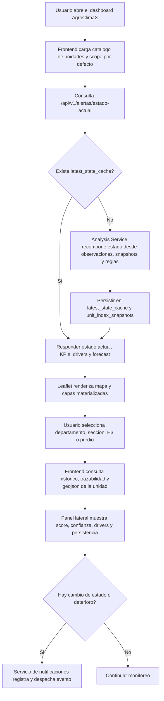
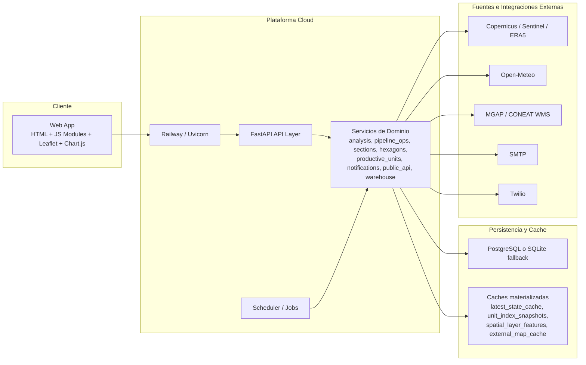

# Documento de Arquitectura y Especificaciones Tecnicas
## AgroClimaX

**Version:** 1.0  
**Fecha:** 2026-03-25  
**Estado:** Arquitectura base y objetivo evolutivo  
**Marco de referencia:** Estructurado siguiendo buenas practicas alineadas con ISO/IEC 42010

## 1. Resumen Ejecutivo

AgroClimaX es una plataforma de monitoreo y alerta agroclimatica orientada a soporte de decision territorial y productiva. Su objetivo es detectar, explicar y comunicar condiciones de estres hidrico y deterioro agroambiental mediante la integracion de observaciones satelitales, senales meteorologicas, contexto edafologico e informacion espacial operativa.

Desde el punto de vista de negocio, el sistema busca:

- Reducir el tiempo entre la observacion del deterioro y la accion operativa.
- Estandarizar la evaluacion de riesgo agroclimatico a escala nacional.
- Transformar datos satelitales y climaticos en alertas trazables y accionables.
- Habilitar seguimiento por departamento, seccion, hexagono y unidad productiva.
- Crear una base tecnica escalable para notificaciones, validacion de campo y analitica historica.

El sistema actual se comporta como una plataforma geoespacial de alertas con motor analitico propio, cache materializado y pipeline diario. La arquitectura recomendada prioriza consistencia operativa, trazabilidad del dato y desacople progresivo entre consulta interactiva, procesamiento y persistencia.

## 2. Arquitectura de Sistema

### 2.1 Patron arquitectonico

**Patron elegido:** Monolito Modular con pipeline de procesamiento y persistencia geoespacial materializada.

### 2.2 Justificacion de la eleccion

Se adopta un monolito modular porque el dominio funcional esta fuertemente acoplado alrededor de una sola capacidad de negocio: generar, materializar y servir alertas agroclimaticas. Separar prematuramente en microservicios agregaria complejidad operacional, consistencia eventual innecesaria y mayor costo de despliegue para un producto que todavia evoluciona rapido a nivel de reglas, calibracion y modelos espaciales.

La eleccion es consistente con el estado actual del sistema:

- Un solo backend FastAPI centraliza API, dominio, scheduler, notificaciones y servicios geoespaciales.
- La persistencia concentra estados operativos, historico, snapshots, capas materializadas y cache de mapas externos.
- El frontend es una SPA ligera servida como static assets por el mismo backend.
- La logica de dominio esta particionada por modulos de servicio y no por capas tecnicas monoliticas.

### 2.3 Vista logica de alto nivel

La arquitectura se organiza en cinco bloques:

1. **Capa de Presentacion**
   Interfaz web basada en HTML, JavaScript modular, Leaflet y Chart.js.

2. **Capa de API y Orquestacion**
   FastAPI expone endpoints REST para alertas, capas, pipeline, notificaciones, ground truth y unidades productivas.

3. **Capa de Dominio**
   Servicios de analisis, calibracion, agregacion espacial, materializacion, proxy de mapas externos, notificaciones y scheduler.

4. **Capa de Persistencia**
   SQLAlchemy Async sobre PostgreSQL en cloud o SQLite en modo local; geometria en PostGIS cuando este disponible o JSON geoespacial como fallback compatible.

5. **Capa de Integracion Externa**
   Fuentes satelitales y climaticas, Open-Meteo, proxy MGAP/CONEAT, SMTP y Twilio.

### 2.4 Evolucion recomendada

La arquitectura actual es correcta para la etapa de plataforma operativa. La evolucion deseable a mediano plazo es:

- Mantener el backend como monolito modular.
- Desacoplar el plano de procesamiento intensivo hacia workers dedicados.
- Consolidar PostgreSQL con PostGIS real como backend canonico.
- Incorporar colas y ejecucion asyncrona administrada para ETL, recalibracion y notificaciones.
- Introducir autenticacion federada y control de acceso fino cuando la plataforma pase a uso multiusuario productivo.

## 3. Stack Tecnologico

### 3.1 Frontend

| Capa | Tecnologia | Uso |
|---|---|---|
| UI Web | HTML5, CSS3, JavaScript ES Modules | Dashboard interactivo y mapa operacional |
| Cartografia | Leaflet | Render de mapas, overlays WMS/GeoJSON y seleccion espacial |
| Visualizacion | Chart.js | Series temporales y componentes de contexto |
| Organizacion del cliente | `app.js`, `api.js`, `map.js`, `render.js`, `state.js` | Modularizacion de estado, llamadas API y render |

### 3.2 Backend

| Capa | Tecnologia | Uso |
|---|---|---|
| Framework API | FastAPI | API REST, docs OpenAPI, health endpoints |
| Servidor ASGI | Uvicorn | Runtime del backend |
| Cliente HTTP | httpx, requests | Integraciones con Open-Meteo, WMS externos y proveedores |
| Computo cientifico | NumPy | Calculos cuantiles, scoring y procesamiento numerico |
| Geoespacial | Shapely, H3, pyshp, GeoAlchemy2 | Geometria, malla hexagonal, importacion shapefile y soporte espacial |
| Configuracion | Pydantic Settings, python-dotenv | Configuracion por entorno |
| Correo | aiosmtplib | Envio SMTP |
| Mensajeria | Twilio API por HTTP | SMS y WhatsApp |

### 3.3 Base de Datos y Persistencia

| Capa | Tecnologia | Uso |
|---|---|---|
| Persistencia local | SQLite + aiosqlite | Desarrollo local y fallback |
| Persistencia cloud | PostgreSQL + asyncpg / psycopg2 | Base operacional en Railway |
| Extension espacial objetivo | PostGIS | Geometrias indexadas y consultas espaciales avanzadas |
| ORM | SQLAlchemy 2 Async | Mapeo, sesiones async, materializacion |
| Cache de ultimo estado | Tabla `latest_state_cache` | Respuesta rapida de dashboard y APIs |
| Cache de mapas externos | Tabla `external_map_cache` | Reuso de tiles y respuestas WMS |

### 3.4 Infraestructura

| Capa | Tecnologia | Uso |
|---|---|---|
| Hosting principal | Railway | Deploy cloud del backend |
| Contenedores | Docker | Empaquetado y consistencia de ejecucion |
| Orquestacion local | Docker Compose | Backend, PostgreSQL/Timescale, Redis, workers |
| Red | HTTPS administrado por plataforma | Exposicion segura de API y dashboard |
| Programacion de procesos | Scheduler interno y opcion Celery/Redis | Pipeline diario, recalibracion, materializacion |

### 3.5 DevOps y Operacion

| Capacidad | Tecnologia / Practica |
|---|---|
| Control de versiones | Git |
| Entornos | Desarrollo local, staging implicito, produccion en Railway |
| Health checks | `/health`, `/api/health` |
| Configuracion | Variables de entorno por servicio |
| Warmup y pre-cache | Inicializacion de catalogos, capas, cache y CONEAT |
| Observabilidad minima | Logs de aplicacion, `pipeline_runs`, `ingestion_quality_logs` |

## 4. Funcionalidades Logicas y Modulos

### 4.1 Catalogo espacial y unidades operativas

Responsabilidad:

- Mantener el inventario de unidades de analisis (`aoi_units`).
- Gestionar departamentos, secciones, hexagonos H3 y unidades productivas importadas.
- Resolver jerarquia espacial: departamento, seccion, H3 y predio/potrero/lote.

Reglas clave:

- Si existe unidad productiva, debe priorizarse sobre H3 como unidad operativa.
- H3 actua como malla fallback homogenea cuando no hay geometria productiva.
- Las capas se materializan para consulta rapida y render estable.

### 4.2 Ingesta satelital y control de calidad

Responsabilidad:

- Ingerir y normalizar observaciones S1, S2, SPI y forecast.
- Registrar calidad de escena, cobertura valida, lag, nubosidad y motivo de fallback.
- Persistir observaciones y logs de calidad por unidad.

Reglas clave:

- Toda observacion debe quedar acompañada de metadata de calidad y modo de origen.
- El sistema admite `live`, `carry-forward` y `simulated`, pero debe explicitar el origen.
- El pipeline debe ser idempotente por fecha, scope y tipo de proceso.

### 4.3 Calibracion automatica

Responsabilidad:

- Recalibrar la relacion VV-NDMI con ventana rodante.
- Persistir snapshots de calibracion por departamento, clase de cobertura y mascara de vegetacion.
- Soportar fallback controlado hasta matriz fija de referencia.

Reglas clave:

- La calibracion debe ser monotona y trazable.
- Cada snapshot conserva calidad, cuantiles, ventana y nivel de fallback.
- La referencia de calibracion debe viajar con el estado de alerta.

### 4.4 Motor de scoring y estado de alerta

Responsabilidad:

- Calcular `risk_score` y `confidence_score`.
- Determinar el estado operativo: Normal, Vigilancia, Alerta o Emergencia.
- Aplicar persistencia, histeresis y logica de accionabilidad.

Logica de negocio resumida:

- `risk_score` sintetiza magnitud, persistencia, anomalia temporal, confirmacion meteorologica y vulnerabilidad del suelo.
- `confidence_score` mide frescura, acuerdo entre fuentes, aplicabilidad de radar, calidad de calibracion y validacion de campo.
- La subida de estado requiere evidencia sostenida; la bajada exige mejora persistente y condiciones de forecast compatibles.

### 4.5 Agregacion espacial y capas materializadas

Responsabilidad:

- Consolidar indicadores por departamento, seccion, hexagono y unidad productiva.
- Materializar geometria y propiedades listas para frontend.
- Servir capas desde base de datos en vez de recomputar por request.

Reglas clave:

- El dashboard siempre debe consultar cache o snapshots materializados antes de disparar recomputo.
- Las capas deben publicarse con propiedades suficientes para render, tooltips y seleccion.
- La actualizacion materializada forma parte del pipeline diario.

### 4.6 Pipeline operativo y scheduler

Responsabilidad:

- Ejecutar analisis diario, recalibracion semanal, materializacion y backfill.
- Mantener el historial de corridas y estado operativo del sistema.
- Controlar reintentos, stale runs y consistencia de procesamiento.

Reglas clave:

- Cada corrida se registra en `pipeline_runs`.
- El scheduler no debe lanzar procesos duplicados sobre la misma ventana.
- Las corridas deben dejar evidencia de duracion, estado y detalle operativo.

### 4.7 Notificaciones y suscripciones

Responsabilidad:

- Resolver suscriptores por unidad o departamento.
- Emitir eventos por dashboard, email, SMS y WhatsApp.
- Registrar el historial de despachos y evitar duplicados.

Reglas clave:

- Solo se dispara una notificacion ante cambio de estado, cambio fuerte de confianza o deterioro relevante de forecast.
- El mensaje debe ser explicable y operacional.
- Todo envio debe quedar auditado en `notification_events`.

### 4.8 Ground truth y validacion de campo

Responsabilidad:

- Ingerir mediciones de sensores u observaciones de campo.
- Aportar validacion a confianza y calibracion.
- Dejar base para evaluacion de falsos positivos y falsos negativos.

### 4.9 Proxy y cache de cartografia externa

Responsabilidad:

- Consumir cartografia WMS externa, especialmente CONEAT.
- Evitar timeouts, mixed content y sobrecarga de origen.
- Precalentar y persistir tiles criticas.

## 5. Diagramas de Arquitectura

### 5.1 Diagrama de Flujo de Usuario

### 5.2 Diagrama de Arquitectura de Nube

### 5.3 Diagrama de Entidad-Relacion

```mermaid
erDiagram
    AOI_UNITS {
        string id PK
        string unit_type
        string scope
        string name
        string department
        json geometry_geojson
        string coverage_class
        string data_mode
    }

    SATELLITE_OBSERVATIONS {
        string id PK
        string unit_id FK
        datetime observed_at
        float s1_humidity_mean_pct
        float s2_ndmi_mean
        float spi_30d
        float quality_score
        json quality_control
    }

    CALIBRATION_SNAPSHOTS {
        string id PK
        string department
        string coverage_class
        string vegetation_mask
        datetime generated_at
        int sample_count
        string fallback_level
        float quality_score
    }

    FORECAST_SIGNALS {
        string id PK
        string unit_id FK
        datetime forecast_date
        float precip_mm
        float et0_mm
        float expected_risk
    }

    ALERT_STATES {
        string id PK
        string unit_id FK
        datetime observed_at
        string current_state
        int state_level
        float risk_score
        float confidence_score
        float affected_pct
        int days_in_state
    }

    ALERTAS_EVENTOS {
        string id PK
        string unit_id FK
        datetime fecha
        int nivel
        float risk_score
        float confidence_score
        bool actionable
    }

    UNIT_INDEX_SNAPSHOTS {
        string id PK
        string unit_id FK
        datetime observed_at
        string state
        float risk_score
        float confidence_score
        float s1_humidity_mean_pct
        float s2_ndmi_mean
        float spi_30d
    }

    LATEST_STATE_CACHE {
        string id PK
        string cache_key
        string unit_id FK
        string scope
        datetime observed_at
        json payload
    }

    SPATIAL_LAYER_FEATURES {
        string id PK
        string layer_scope
        string unit_id FK
        string department
        datetime observed_at
        json geometry_geojson
        json properties
    }

    SATELLITE_LAYER_CATALOG {
        string layer_key PK
        string display_name
        string provider
        string source_dataset
    }

    SATELLITE_LAYER_SNAPSHOTS {
        string id PK
        string unit_id FK
        string layer_key FK
        datetime observed_at
        string source_mode
        json summary_stats
    }

    INGESTION_QUALITY_LOGS {
        string id PK
        string unit_id FK
        datetime observed_at
        string provider
        string status
        float quality_score
        string fallback_reason
    }

    GROUND_TRUTH_MEASUREMENTS {
        string id PK
        string unit_id FK
        datetime observed_at
        string source_type
        float soil_moisture_pct
        float confidence
    }

    PIPELINE_RUNS {
        string id PK
        string job_key
        string job_type
        string scope
        date target_date
        string status
    }

    SUSCRIPTORES_ALERTAS {
        string id PK
        string nombre
        string unit_id FK
        string departamento
        int nivel_minimo
        bool activo
    }

    NOTIFICATION_EVENTS {
        string id PK
        string alert_event_id FK
        string channel
        string recipient
        string status
        string reason
    }

    AOI_UNITS ||--o{ SATELLITE_OBSERVATIONS : receives
    AOI_UNITS ||--o{ FORECAST_SIGNALS : projects
    AOI_UNITS ||--o| ALERT_STATES : current_state
    AOI_UNITS ||--o{ ALERTAS_EVENTOS : produces
    AOI_UNITS ||--o{ UNIT_INDEX_SNAPSHOTS : aggregates
    AOI_UNITS ||--o{ LATEST_STATE_CACHE : caches
    AOI_UNITS ||--o{ SPATIAL_LAYER_FEATURES : materializes
    AOI_UNITS ||--o{ SATELLITE_LAYER_SNAPSHOTS : stores
    AOI_UNITS ||--o{ INGESTION_QUALITY_LOGS : audits
    AOI_UNITS ||--o{ GROUND_TRUTH_MEASUREMENTS : validates
    AOI_UNITS ||--o{ SUSCRIPTORES_ALERTAS : subscribes
    CALIBRATION_SNAPSHOTS ||--o{ ALERT_STATES : calibrates
    SATELLITE_LAYER_CATALOG ||--o{ SATELLITE_LAYER_SNAPSHOTS : catalogs
    ALERTAS_EVENTOS ||--o{ NOTIFICATION_EVENTS : triggers
```

## 6. Atributos de Calidad

### 6.1 Escalabilidad

La escalabilidad se aborda por materializacion, no por recomputo permanente:

- Cache de ultimo estado para consultas frecuentes.
- Snapshots de indices por unidad y fecha.
- Capas espaciales materializadas para mapa.
- Desacople entre consulta interactiva y pipeline diario.
- Capacidad de evolucionar a workers dedicados sin redisenar el dominio.

Decisiones recomendadas:

- PostgreSQL con PostGIS como backend canonico.
- Redis/Celery o cola equivalente para procesos pesados.
- Politicas de particion o archivado para snapshots historicos cuando el volumen crezca.

### 6.2 Seguridad

**Estado actual:** el sistema utiliza configuracion por entorno y soporta API keys para integraciones de ground truth, pero no presenta todavia un esquema completo de identidad multiusuario de nivel enterprise.

**Arquitectura recomendada para produccion:**

- OAuth2/OIDC para autenticacion de usuarios y aplicaciones.
- JWT de corta duracion para autorizacion stateless del frontend.
- Refresh tokens con rotacion para sesiones persistentes.
- RBAC por rol y por scope espacial.
- Secrets gestionados por plataforma y nunca embebidos en frontend.
- TLS extremo a extremo.
- Validacion estricta de archivos importados y payloads geoespaciales.
- Auditoria de acciones administrativas, importaciones y notificaciones.

### 6.3 Disponibilidad

La disponibilidad se apoya en:

- Health checks de plataforma.
- Warmup de cache al inicio.
- Reintentos y control de stale runs en el pipeline.
- Cache de mapas externos para reducir dependencia de WMS de terceros.
- Fallback local y degradacion controlada del modo de dato.

Objetivos recomendados:

- Disponibilidad de lectura mayor a 99.5%.
- Recuperacion automatica ante reinicio de proceso.
- RTO menor a 30 minutos para pipeline diario.
- RPO de 24 horas para datos operativos si no hay replica multi-zona.

## 7. Flujos de Datos

### 7.1 Flujo de consulta desde el cliente hasta persistencia

1. El usuario abre el dashboard web.
2. El frontend carga unidades, estado actual y capas del scope activo.
3. FastAPI consulta primero `latest_state_cache` y capas materializadas.
4. Si existe cache vigente, responde inmediatamente.
5. Si no existe, el servicio de analisis recompone el estado desde:
   - `satellite_observations`
   - `forecast_signals`
   - `calibration_snapshots`
   - `ground_truth_measurements`
   - reglas de scoring, persistencia e histeresis
6. El resultado se persiste en:
   - `alert_states`
   - `unit_index_snapshots`
   - `latest_state_cache`
7. El frontend renderiza KPIs, drivers, forecast, historico y geometria seleccionada.

### 7.2 Flujo de ingesta y procesamiento diario

1. El scheduler crea una corrida en `pipeline_runs`.
2. El pipeline consulta fuentes externas satelitales, meteorologicas y cartograficas.
3. Se normaliza la informacion por unidad espacial.
4. Se registran logs de calidad en `ingestion_quality_logs`.
5. Se persisten observaciones en `satellite_observations` y `forecast_signals`.
6. Se recalculan calibraciones si corresponde la ventana semanal.
7. Se ejecuta el motor de riesgo y se actualizan estados.
8. Se regeneran capas materializadas y cache del ultimo estado.
9. Si existen cambios relevantes, se generan eventos de notificacion.

### 7.3 Flujo de notificacion operacional

1. Un cambio de estado o deterioro relevante genera un `alert_event`.
2. El modulo de notificaciones resuelve suscriptores por unidad o departamento.
3. Se construye un payload explicable con:
   - estado
   - riesgo
   - confianza
   - dias en deterioro
   - porcentaje afectado
   - driver principal
   - forecast maximo
4. Se registra el intento en `notification_events`.
5. El sistema despacha por dashboard, email, SMS o WhatsApp.

### 7.4 Flujo de importacion de unidades productivas

1. El usuario carga un archivo GeoJSON o shapefile zip desde la interfaz.
2. El backend valida estructura, categoria y geometria.
3. Se crean o actualizan registros en `aoi_units`.
4. Se materializa la capa productiva en `spatial_layer_features`.
5. El sistema habilita consulta de estados e historico por predio/potrero/lote.

## 8. Consideraciones Finales

AgroClimaX ya cuenta con una base arquitectonica consistente para operar como plataforma nacional de alertas agroclimaticas. La decision correcta es continuar consolidando el monolito modular, reforzar la persistencia geoespacial y endurecer seguridad, observabilidad y autenticacion antes de fragmentar la solucion en microservicios.

Las siguientes prioridades tecnicas recomendadas son:

1. Consolidar PostgreSQL con PostGIS real como backend canonico.
2. Implementar autenticacion OAuth2/OIDC y JWT para acceso multiusuario.
3. Separar workers de procesamiento intensivo del plano de consulta.
4. Incorporar predios/potreros reales como unidad principal de decision.
5. Formalizar CI/CD y pruebas end-to-end para operacion continua.
