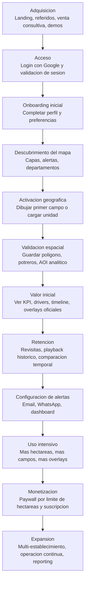
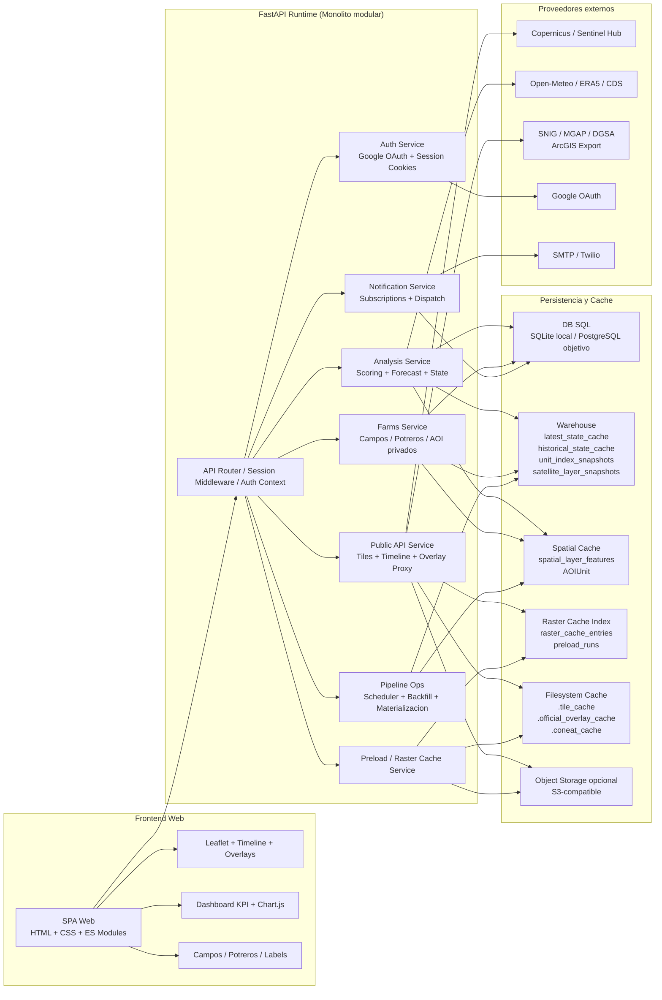
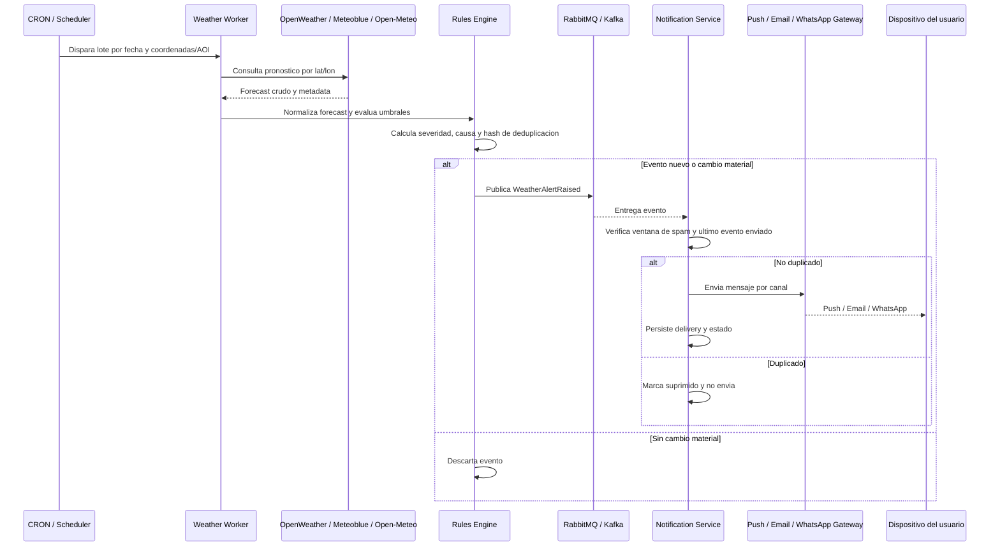

# Documento de Arquitectura de Software Definitivo
## AgroClimaX

**Version:** 1.0  
**Fecha:** 2026-04-04  
**Estado:** Canonico - estado actual implementado con roadmap tecnico  
**Audiencia:** CTO, Ingenieria de Datos, Desarrollo, Operaciones  
**Criterio editorial:** El documento describe primero la arquitectura realmente implementada y, en secciones separadas, explicita la evolucion recomendada.

---

## 1. Vision General y Stack Tecnologico

### 1.1 Proposito del sistema

AgroClimaX es una plataforma de monitoreo agroclimatico y ambiental orientada a transformar observaciones satelitales, senales meteorologicas, contexto edafologico y geometria operativa en:

- estados de alerta accionables
- series historicas auditables
- overlays raster y vectoriales consumibles desde un mapa operacional
- notificaciones por canal configurado
- analitica por departamento, unidad productiva, campo y potrero

El producto no opera solo como visor GIS. Su nucleo es un **motor de evaluacion territorial** que materializa estado actual, historico, capas espaciales, timeline temporal y caches de acceso rapido para una experiencia interactiva en frontend.

### 1.2 Patron arquitectonico actual

El estado actual de AgroClimaX es un **monolito modular geoespacial** desplegado como una aplicacion FastAPI que expone API REST, sirve el frontend web como static assets y coordina internamente:

- autenticacion y sesiones
- pipeline diario y backfill historico
- materializacion de warehouse y caches
- proxy de capas satelitales y overlays oficiales
- notificaciones y suscripciones
- gestion de campos, potreros y unidades productivas

No hay microservicios fisicamente desplegados como procesos independientes de negocio. Sin embargo, la base de codigo ya esta organizada por dominios suficientemente desacoplados como para permitir una evolucion futura hacia servicios separados.

### 1.3 Stack tecnologico actual

#### Frontend

| Capa | Tecnologia actual | Rol tecnico |
|---|---|---|
| SPA web | HTML5 + CSS3 + JavaScript ES Modules | Shell de producto, navegacion y bootstrapping |
| Motor cartografico | Leaflet | Mapa base, overlays temporales, capas oficiales y geometria editable |
| Visualizacion analitica | Chart.js | Serie historica, trend chart y widgets KPI |
| Estado cliente | `state.js` + controladores modulares | Estado de seleccion, timeline, preload, capas y paneles |
| Modulos UI | `app.js`, `map.js`, `render.js`, `fields.js`, `profile.js`, `settings.js` | Orquestacion de UX, dashboard, timeline y gestion espacial |

#### Backend

| Capa | Tecnologia actual | Rol tecnico |
|---|---|---|
| API | FastAPI | Routing REST, auth, servicios publicos y privados |
| Runtime ASGI | Uvicorn | Ejecucion del backend |
| ORM / acceso datos | SQLAlchemy 2 Async | Persistencia transaccional y materializacion |
| Geometria | Shapely, GeoAlchemy2 | Operaciones sobre AOI, clipping logico, centroides, tolerancias, serializacion espacial |
| Teselado y malla | H3 | Capas hexagonales y fallback espacial |
| Computo numerico | NumPy, estadistica estandar Python | scoring, percentiles, interpolacion y agregaciones |
| Integraciones HTTP | httpx, requests | Open-Meteo, Google OAuth, Copernicus/Sentinel Hub, ArcGIS export |

#### Persistencia y almacenamiento

| Capa | Tecnologia actual | Rol tecnico |
|---|---|---|
| Base de datos local | SQLite + aiosqlite | Desarrollo local, testing y fallback |
| Base de datos objetivo | PostgreSQL + asyncpg / psycopg2 | Runtime cloud y persistencia principal |
| Extension espacial objetivo | PostGIS | Backend espacial nativo cuando esta disponible |
| Cache de ultimo estado | `latest_state_cache` | Respuestas de dashboard y APIs de estado actual |
| Warehouse historico | `historical_state_cache`, `unit_index_snapshots`, `satellite_layer_snapshots` | Timeline, historico y trazabilidad diaria |
| Cache raster indexado | `raster_cache_entries`, `preload_runs` | Warm-cache temporal y control de precarga |
| Storage local | `.tile_cache`, `.official_overlay_cache`, `.coneat_cache` | Cache filesystem de raster y overlays |
| Object storage opcional | S3-compatible | Reuso de tiles y overlays entre instancias |

#### Infraestructura y operacion

| Capa | Tecnologia actual | Rol tecnico |
|---|---|---|
| Deploy cloud | Railway | Hosting del backend y exposicion HTTPS |
| Contenedorizacion | Docker | Empaquetado y runtime portable |
| Scheduler | loop interno + jobs de pipeline | Ejecucion diaria, recalibracion, materializacion y backfill |
| Health endpoints | `/health`, `/api/health` | Verificacion de disponibilidad |
| Sesiones | Cookie de sesion firmada + Google OAuth | Acceso autenticado a APIs protegidas |

### 1.4 Inventario de modulos de backend

Los modulos dominiales presentes hoy en `apps/backend/app/services` son:

| Modulo | Responsabilidad principal |
|---|---|
| `analysis.py` | motor analitico, scoring, snapshots, historico, forecast y timeline context |
| `public_api.py` | tiles temporales, timeline manifest, overlays oficiales, proxy raster |
| `pipeline_ops.py` | scheduler, jobs manuales, backfill y estado operativo |
| `warehouse.py` | catalogo de capas, snapshots, latest cache, historical cache y features materializadas |
| `farms.py` | establecimientos, campos, potreros, AOI analiticos y agregacion ponderada |
| `productive_units.py` | importacion y materializacion de unidades productivas |
| `notifications.py` | suscripciones, eventos, email, WhatsApp y dashboard notifications |
| `preload.py` | warm-cache de timeline, viewport y overlays |
| `raster_cache.py` | indice de cache raster y tracking de precarga |
| `auth.py` | Google OAuth, sesiones, CSRF y contexto de usuario |

### 1.5 Evolucion recomendada

El stack actual es consistente con la etapa del producto. La evolucion recomendada no es una reescritura, sino una extraccion progresiva de planos de responsabilidad:

- **Geospatial Processing Service**: ETL satelital, clipping, estadisticas zonales y generacion de productos.
- **Climate Rules Service**: forecast, eventos meteorologicos y scoring rule engine.
- **Notification Service**: procesamiento asincrono multi-canal sobre cola de eventos.
- **Raster Gateway / Tile Service**: caching de COGs, WMTS interno y normalizacion de overlays.
- **Infraestructura objetivo**: PostgreSQL + PostGIS dedicado, Redis para cache caliente, RabbitMQ o Kafka para mensajeria, object storage como backend canonico de raster, orquestacion en Kubernetes.

El documento tratara esas piezas como **roadmap**, no como realidad operativa actual.

---

## 2. Funcionalidades Principales (Core Features)

### 2.1 Gestion de parcelas, campos y potreros

El modulo de campos permite gestionar geometria operativa privada por usuario:

- establecimientos
- campos vinculados a padrones y departamento
- potreros internos con validacion topologica

Capacidades tecnicas vigentes:

- alta, edicion y baja logica de establecimientos, campos y potreros
- soporte GeoJSON como formato de intercambio
- validacion de contencion de potreros dentro del campo con tolerancia operativa de 10 m
- creacion de `AOIUnit` analitico asociado a campo y potrero
- publicacion de `field_analytics` y `paddock_analytics`
- agregacion ponderada de campo a partir de potreros cuando existen snapshots vigentes

### 2.2 Motor de teledeteccion e indices

El motor satelital soporta capas temporales operativas:

- `alerta`
- `rgb`
- `ndvi`
- `ndmi`
- `ndwi`
- `savi`
- `sar`
- `lst`

Capacidades tecnicas vigentes:

- manifesto temporal diario de 365 dias
- resolucion de frame por `primary_source_date` y `secondary_source_date`
- carry-forward e interpolacion visual cuando falta adquisicion exacta
- cache filesystem + object storage opcional
- calentamiento de viewport y vecinos de timeline
- timeline sincronizada con el dashboard analitico

### 2.3 Motor de clima y scoring

El motor analitico integra:

- senales S1 / S2
- forecast Open-Meteo
- SPI-30
- contexto de suelo inferido
- reglas de negocio configurables

Salidas materializadas:

- `risk_score`
- `confidence_score`
- `state`
- `drivers`
- `forecast`
- `latest_state_cache`
- `historical_state_cache`
- `unit_index_snapshots`

### 2.4 Sistema de notificaciones y suscripciones

El runtime actual soporta:

- suscripciones por `national`, `department`, `productive_unit` y `field`
- dashboard events
- email por SMTP
- WhatsApp por Twilio

La deduplicacion actual se apoya en:

- `alertas_eventos`
- `notification_events`
- `reason_key`
- hash logico de despacho por alcance, estado y causa

### 2.5 Capas oficiales y analitica territorial

El mapa integra overlays oficiales de Uruguay via proxy `ArcGIS export`:

- CONEAT
- Hidrografia
- Area inundable
- Catastro rural
- Rutas y camineria
- Zonas sensibles

Tambien expone capas propias:

- departamentos
- secciones
- H3
- unidades productivas
- campos y potreros privados del usuario

### 2.6 Timeline historica y warm-cache

El producto incorpora una timeline historica de 365 dias con:

- scrub manual
- playback
- speeds multi-factor
- prefetch y preload por viewport
- warehouse historico para contexto analitico
- popup de precarga inicial

Esto convierte al mapa en un **reproductor temporal** de raster + contexto analitico, no solo en un visor estatico.

---

## 3. Funnel de Usuario

### Lectura tecnica del funnel

| Etapa | Objetivo del sistema | Riesgo principal |
|---|---|---|
| Adquisicion | Convertir interes en sesion autenticada | Baja comprension del valor operativo |
| Onboarding | Llevar al usuario a su primer AOI valido | Friccion geomatrica y ausencia de contexto |
| Activacion | Mostrar analitica inmediata tras el primer poligono | Carga lenta de raster o datos no visibles |
| Retencion | Instalar el habito de revisar cambios, timeline y alertas | Buffering, falta de fluidez temporal, ruido visual |
| Monetizacion | Cobrar por cobertura operativa y continuidad | Desalineacion entre valor percibido y limite de hectareas |

**Disparadores de conversion actuales**

- dibujo del primer poligono
- aparicion de KPI y etiqueta geografica sobre campo/potrero
- configuracion de alertas
- playback historico como demostracion de valor

**Puntos de friccion actuales**

- cold-start raster
- buffering del timelapse cuando el viewport no esta warm
- coexistencia de muchas capas temporales activas
- dependencia de proveedores externos para primera pasada de tiles

---

## 4. Arquitectura Logica de la Aplicacion

### 4.1 Diagrama de arquitectura logica

### 4.2 Responsabilidad por capa

#### Frontend web

Responsabilidades:

- render cartografico y dashboard
- seleccion de alcance (`nacional`, `departamento`, `unidad`, `field`, `paddock`)
- timeline y playback
- precarga inicial y progress UI
- edicion geomatrica y etiquetas movibles

Hecho relevante: el frontend no calcula el KPI primario. Consume payloads materializados desde backend.

#### API Gateway / FastAPI app

Responsabilidades:

- autenticar requests
- montar routers `/api/v1/*` y alias legacy `/api/*`
- servir static assets del frontend
- ejecutar bootstrap y scheduler/warmup segun `app_runtime_role`

#### Servicios internos

**Auth Service**
- Google OAuth
- session cookie firmada
- CSRF token
- serializacion de usuario y perfil

**Analysis Service**
- snapshot actual
- historico
- forecast
- scoring
- timeline context
- fallbacks live / carry-forward / simulated

**Public API / Geo Service**
- tiles temporales por fecha
- overlays oficiales proxyados
- manifest de timeline
- tiles raster desde Sentinel Hub

**Farms Service**
- modelo privado por usuario
- mapping `campo/potrero -> AOIUnit`
- agregacion ponderada a nivel campo

**Pipeline Ops**
- scheduler
- daily pipeline
- recalibracion
- materializacion
- backfill historico

**Notification Service**
- evaluacion de razones de disparo
- despacho multicanal
- persistencia de eventos y deduplicacion

**Preload / Raster Cache**
- startup preload
- viewport preload
- timeline window preload
- tracking de progreso y warm status

### 4.3 Persistencia, warehouse y cache

#### Persistencia estructural

Principales tablas y artefactos:

| Entidad | Funcion |
|---|---|
| `AOIUnit` | unidad geometrica base para departamentos, H3, productivas, campos y potreros |
| `AlertState` | ultimo estado operativo por unidad |
| `AlertaEvento` | historial de eventos de alerta |
| `AlertSubscription` | suscripciones configurables por usuario |
| `NotificationEvent` | evidencia de entregas y deduplicacion |
| `FarmField`, `FarmPaddock` | geometria privada del usuario |

#### Warehouse y materializacion

| Tabla | Funcion |
|---|---|
| `latest_state_cache` | payload rapido para dashboard actual |
| `historical_state_cache` | payload enriquecido por fecha para timeline |
| `unit_index_snapshots` | snapshot diario de indices y scores |
| `satellite_layer_snapshots` | metadata por capa, fecha y disponibilidad temporal |
| `spatial_layer_features` | features materializadas listas para frontend |

#### Cache raster

| Recurso | Funcion |
|---|---|
| `.tile_cache` | tiles temporales Copernicus generados bajo demanda |
| `.official_overlay_cache` | overlays oficiales viewport-based |
| `.coneat_cache` | cache especializado de CONEAT |
| `raster_cache_entries` | indice DB de estado warm/missing/ready |
| `preload_runs` | seguimiento transaccional de runs de precarga |

### 4.4 Interfaces publicas relevantes

| Endpoint | Rol |
|---|---|
| `GET /api/v1/alertas/estado-actual` | snapshot actual por scope |
| `GET /api/v1/alertas/historico` | historico agregado |
| `GET /api/v1/alertas/pronostico` | forecast enriquecido |
| `GET /api/v1/timeline/frames` | manifiesto temporal diario |
| `GET /api/v1/timeline/context` | contexto analitico historico por fecha |
| `GET /api/v1/tiles/{layer}/{z}/{x}/{y}.png` | tile temporal por capa y fecha |
| `GET /api/v1/map-overlays/catalog` | catalogo de overlays oficiales |
| `GET /api/v1/map-overlays/{overlay_id}/tile` | proxy raster de overlay oficial |
| `POST /api/v1/preload/*` | warm-cache de startup, viewport y timeline |
| `GET/POST/PUT/DELETE /api/v1/campos*` | CRUD de establecimientos, campos y potreros |
| `POST /api/v1/pipeline/*` | jobs manuales, materializacion y backfill |

---

## 5. Logica Tecnica: Teledeteccion de Indices

### 5.1 Fuentes y capas operativas

Las capas temporales visibles en el mapa combinan tres clases de fuente:

1. **Sentinel-2 L2A**
   - `rgb`
   - `ndvi`
   - `ndmi`
   - `ndwi`
   - `savi`

2. **Sentinel-1 GRD**
   - `sar`

3. **Sentinel-3 SLSTR / capa derivada**
   - `lst`

4. **Fusion AgroClimaX**
   - `alerta_fusion` usando S1 + S2 + SPI

El acceso raster se hace hoy contra `SH_PROCESS_URL` usando evalscripts y ventanas temporales por capa.

### 5.2 Pipeline ETL actual

El ETL actual combina dos planos distintos:

- **Plano analitico por unidad**: estado, indices y scores que alimentan KPI y alertas.
- **Plano raster de visualizacion**: tiles temporales generados por demanda para el mapa.

#### 5.2.1 Plano analitico por unidad

1. **Catalog bootstrap**
   - se siembran departamentos y catalogos base
   - se garantizan `AOIUnit` y catalogo de capas

2. **Prefetch live**
   - `run_daily_pipeline()` obtiene unidades departamento
   - `_prefetch_live_observations()` intenta resolver observaciones live para el `target_date`
   - si Copernicus no esta disponible, el pipeline no falla; cae a otros modos

3. **Control de calidad**
   - se computa `freshness_days`
   - `coverage_valid_pct`
   - `cloud_cover_pct`
   - `lag_hours` entre fuentes
   - `quality_score`
   - `fallback_reason`

4. **Fallback controlado**
   - `live_copernicus`
   - `carry_forward_live`
   - `simulated`

5. **Scoring**
   - estimacion de NDMI y humedad
   - composicion de `risk_score`
   - composicion de `confidence_score`
   - determinacion de `state` y `state_level`

6. **Materializacion**
   - `unit_index_snapshots`
   - `historical_state_cache`
   - `latest_state_cache`
   - `satellite_layer_snapshots`
   - `spatial_layer_features`

7. **Agregaciones derivadas**
   - nacional
   - secciones
   - H3
   - unidades productivas
   - campos y potreros

#### 5.2.2 Plano raster de visualizacion

1. El frontend solicita `/api/v1/tiles/{layer}/{z}/{x}/{y}.png?source_date=YYYY-MM-DD`.
2. `fetch_tile_png()` resuelve:
   - capa interna
   - `target_date`
   - `primary_source_date`
   - `secondary_source_date` si aplica
3. Se consulta cache en este orden:
   - filesystem local
   - object storage opcional
   - proveedor remoto
4. Si no existe tile caliente:
   - se construye payload `SH_PROCESS_URL`
   - se aplica evalscript por capa
   - se define `timeRange`
   - para Sentinel-2 se aplica `maxCloudCoverage = 50`
5. El PNG resultante se guarda en cache y puede indexarse como warm-ready.

### 5.3 Mascara de nubes, ventana temporal y clipping

#### Mascara de nubes

En el plano raster actual, la mascara de nubes se expresa operacionalmente por:

- `maxCloudCoverage` en requests de Sentinel-2
- `dataMask` dentro de evalscripts
- `s2_valid_pct` y `cloud_cover_pct` dentro del plano analitico

Esto significa que la plataforma no solo "pinta" un indice: tambien conserva la calidad de la escena y usa esa calidad dentro del `confidence_score`.

#### Ventana temporal

Cada capa tiene una semantica temporal distinta:

| Capa | Revisit / ventana | Modo temporal |
|---|---|---|
| `alerta` | diaria | `carry_forward` |
| `rgb`, `ndvi`, `ndmi`, `ndwi`, `savi` | ~5 dias | `symmetric` |
| `sar` | ~6 dias | `symmetric` |
| `lst` | diaria | `symmetric` |

El manifesto temporal se construye desde `satellite_layer_snapshots` y, si falta un dia exacto:

- usa carry-forward para `alerta`
- usa frame anterior/posterior e interpolacion visual para capas opticas/radar

#### Recorte espacial

El estado actual utiliza dos mecanismos complementarios:

1. **Analitica por AOI**
   - el motor live trabaja sobre la geometria de la unidad (`AOIUnit.geometry_geojson`)
   - para unidades privadas, `campo` y `potrero` se reflejan como `AOIUnit` de tipo `productive_unit`

2. **Raster en mapa**
   - el render visible se hace por `bbox` de tile o viewport
   - el clipping fino del AOI no se usa para el tile final del mapa; se usa para analitica y semantica por unidad

Esa separacion es importante: el tile es una representacion visual; el KPI canonico sale del warehouse analitico.

### 5.4 Formulas de indices

#### NDVI

La implementacion de render usa bandas de Sentinel-2 compatibles con:

$$
NDVI = \frac{\rho_{NIR} - \rho_{Red}}{\rho_{NIR} + \rho_{Red} + \epsilon}
$$

En el producto:

- \( \rho_{NIR} \rightarrow B08 \)
- \( \rho_{Red} \rightarrow B04 \)
- \( \epsilon \) es un termino pequeno para evitar division por cero

#### NDWI

La capa `ndwi` visible en AgroClimaX utiliza la variante operacional:

$$
NDWI = \frac{\rho_{Green} - \rho_{NIR}}{\rho_{Green} + \rho_{NIR} + \epsilon}
$$

En el producto:

- \( \rho_{Green} \rightarrow B03 \)
- \( \rho_{NIR} \rightarrow B08 \)

#### NDMI

Aunque el requerimiento minimo de este documento es NDVI y NDWI, el motor hidrico actual se apoya fuertemente en NDMI:

$$
NDMI = \frac{\rho_{NIR} - \rho_{SWIR1}}{\rho_{NIR} + \rho_{SWIR1} + \epsilon}
$$

En el producto:

- \( \rho_{NIR} \rightarrow B08 \)
- \( \rho_{SWIR1} \rightarrow B11 \)

#### SAVI

La capa SAVI visible responde a:

$$
SAVI = \frac{(1 + L)(\rho_{NIR} - \rho_{Red})}{\rho_{NIR} + \rho_{Red} + L}
$$

donde en el renderer actual se utiliza \( L = 0.5 \).

### 5.5 Estadisticas zonales sobre poligonos

Conceptualmente, las estadisticas zonales por unidad responden a:

$$
\mu_{P} = \frac{1}{N_{P}} \sum_{i \in P \cap V} r_i
$$

donde:

- \( P \) es el poligono del AOI
- \( V \) es el conjunto de pixeles validos luego de mascara de nubes/no-data
- \( r_i \) es el valor raster por pixel
- \( N_P \) es la cantidad de pixeles validos dentro del poligono

Percentiles y estadisticas robustas se expresan como:

$$
q_{p,P} = \operatorname{quantile}_p \left( \{ r_i \mid i \in P \cap V \} \right)
$$

En el estado actual de AgroClimaX:

- el warehouse no depende del tile visible para calcular KPI
- las estadisticas del dashboard se materializan por unidad y fecha
- `summary_stats`, `raw_metrics` y `unit_index_snapshots` contienen la vista numerica persistida
- el tile temporal del mapa es una representacion visual sincronizada con `source_date`, no el origen canonico del KPI

### 5.6 Timeline historica

La timeline opera sobre 365 dias y usa dos planos coordinados:

1. **Manifest temporal**
   - `GET /api/v1/timeline/frames`
   - devuelve disponibilidad, interpolacion, fechas fuente y warm status

2. **Contexto analitico**
   - `GET /api/v1/timeline/context`
   - devuelve payload historico ya materializado

Esto evita recalcular el dashboard desde cero al mover la fecha y habilita sincronizacion entre mapa y tarjetas.

---

## 6. Logica Tecnica: Alertas Meteorologicas

### 6.1 Estado actual implementado

El flujo actual de alertas en produccion es **event-driven dentro del monolito**, con persistencia transaccional de eventos:

1. el scheduler o una corrida manual ejecuta pipeline
2. `analysis.py` calcula `AlertState` y `AlertaEvento`
3. `notifications.py` evalua razones de disparo
4. se persisten `NotificationEvent`
5. se envian canales soportados:
   - dashboard
   - email
   - WhatsApp

No existe hoy una cola externa RabbitMQ/Kafka operativa como plano obligatorio del runtime. La mensajeria actual es logica y persistida en base de datos.

### 6.2 Regla de negocio y motor de evaluacion

El motor meteorologico actual usa:

- forecast Open-Meteo por coordenadas
- humedad relativa horaria agregada por dia
- precipitacion diaria
- ET0 FAO
- temperatura maxima/minima
- viento y rafagas
- SPI-30 como senal acumulada

La presion meteorologica se deriva de:

- deficit hidrico esperado
- exceso termico
- componente de viento
- severidad SPI
- alivio si la precipitacion supera la ET0

El resultado se incorpora al `risk_score` y a la explicacion de drivers.

### 6.3 Secuencia objetivo orientada a eventos

> La siguiente secuencia representa la **arquitectura objetivo recomendada** para la evolucion del sistema.  
> El runtime actual implementa este flujo dentro del monolito y persiste eventos en SQL.

### 6.4 Deduplicacion actual

La deduplicacion vigente ya implementa una version operativa de ese principio:

1. **Deteccion de causa**
   - `_notification_reasons()` solo genera disparo si hay cambio material:
     - cambio de estado
     - cambio fuerte de confianza
     - deterioro del forecast

2. **Clave logica de despacho**
   - `_subscription_dispatch_key()` compone una clave por:
     - scope
     - scope_id
     - alert_event_id o fecha
     - estado
     - reason_key

3. **Verificacion de envio previo**
   - antes de despachar se consulta `notification_events`
   - si ya existe un par `(channel, recipient)` para `alert_event_id + reason_key`, no se reenvia

4. **Supresion por falta de cambio**
   - si no hay `reason_codes`, el sistema retorna `no_operational_trigger`

Esto evita spam sin perder trazabilidad de cada decision de envio.

### 6.5 Canales actuales y canales futuros

**Canales actuales**

- dashboard
- email
- WhatsApp

**Canales recomendados a futuro**

- mobile push nativo
- webhook empresarial
- integracion con ticketing / incident management

---

## 7. Roadmap Tecnico

### 7.1 Arquitectura y plataforma

- Consolidar **PostgreSQL + PostGIS** como backend canonico para produccion.
- Extraer el plano de procesamiento pesado a workers dedicados.
- Incorporar **Redis** para cache caliente de manifests, contexto y tiles.
- Introducir **RabbitMQ o Kafka** para notificaciones, jobs diferidos y eventos del pipeline.
- Separar el **tile service** del API transaccional cuando aumente el volumen.

### 7.2 Teledeteccion y datos

- Sustituir dependencias legacy de ingesta por un conector satelital formal.
- Materializar metadatos por escena y cobertura de nube a nivel mas granular.
- Incorporar COGs y/o mosaicos internos para reducir dependencia de render on-demand.
- Calentar tiles y viewport de manera predictiva segun uso real.
- Explicitar en `timeline/frames` los dias visualmente vacios para saltarlos en playback.

### 7.3 UX y rendimiento

- Optimizar el player temporal para reproducir frames realmente distintos, no dias nominales.
- Reducir cold-start raster con preload mas inteligente por viewport y contexto.
- Unificar header, timeline y mapa en un layout de menor costo visual y raster.
- Introducir reglas de prioridad entre capas temporales para playback mas fluido.
- Mejorar estados de carga y observabilidad de buffering en frontend.

### 7.4 Producto geoespacial

- Incorporar topografia derivada (hillshade, pendiente, orientacion).
- Incorporar capas adicionales de suelo, forestal y restricciones ambientales.
- Persistir posiciones de labels y configuracion de capas por usuario.
- Habilitar comparacion temporal multi-fecha y analitica diferencial.

### 7.5 Alertas y mensajeria

- Extraer `Notification Service` con cola y retry policy formal.
- Incorporar push mobile y canales webhook.
- Agregar politicas de rate-limit, quiet-hours y supresion contextual.
- Separar claramente `event detection` de `delivery orchestration`.

### 7.6 Seguridad y observabilidad

- Endurecer CORS y scopes por entorno.
- Incorporar auditoria estructurada de acciones sensibles.
- Introducir trazabilidad por request-id y pipeline-run-id en logs.
- Agregar metricas operativas: tiempo a primer tile, cache hit ratio, pipeline freshness, delivery success ratio.
- Integrar dashboards de observabilidad y alerting operativo.

---

## Conclusiones

AgroClimaX ya opera hoy como una plataforma geoespacial funcional con:

- backend FastAPI modular
- frontend cartografico rico
- warehouse historico
- timeline sincronizada
- gestion privada de campos y potreros
- overlays oficiales proxyados
- notificaciones y suscripciones

Su principal desafio tecnico ya no es "construir la primera version", sino **industrializar el producto**:

- bajar latencia del plano raster
- formalizar el plano orientado a eventos
- consolidar persistencia espacial canonica
- desacoplar procesamiento intensivo
- elevar observabilidad y confiabilidad operativa

Ese recorrido puede hacerse sin reescritura si se mantiene el principio que hoy ya se observa en el codigo: **monolito modular en el plano transaccional, materializacion fuerte en datos, y extraccion progresiva de capacidades cuando el volumen lo justifique**.
